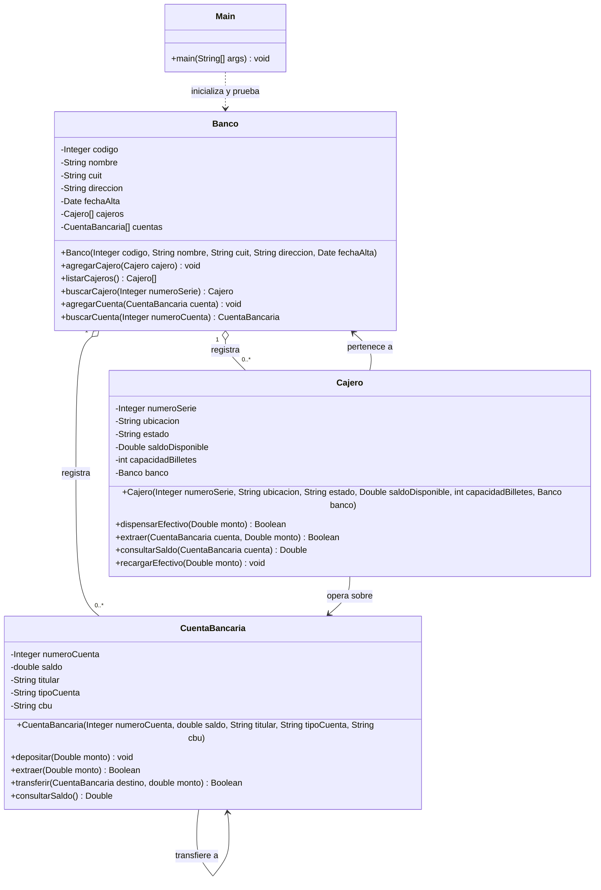
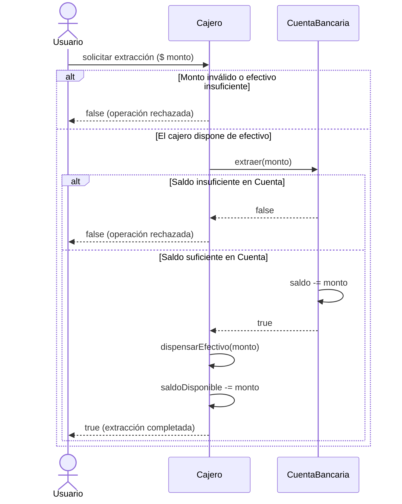

<div align="center">

# 🏦 Simulador Bancario en Java — POO

[](https://github.com/Matydesousa/simulador-bancario-java/actions/workflows/java.yml)
[](https://openjdk.org/)
[](src/)
[-success?style=flat-square)](src/)
[](LICENSE)

---

Proyecto educativo de modelado orientado a objetos en Java que representa las operaciones e interacciones fundamentales de una red bancaria y sus cajeros automáticos.

</div>

## 📌 Descripción

El simulador ilustra cómo interactúan entidades del dominio bancario (bancos, cajeros automáticos y cuentas bancarias), enfatizando la **delegación de responsabilidades**, el **encapsulamiento**, y la **sincronización de estados** entre el dinero disponible en el cajero y el saldo de las cuentas durante extracciones y transferencias.

---

## 🚀 Diagrama de Clases UML

El diagrama resume los atributos y métodos de negocio principales; se omiten accesores y métodos de representación para mantenerlo legible.



---

## 🔄 Flujo de Extracción en Cajero



---

## ✨ Principios de Diseño POO Demostrados

| Principio / Concepto | Implementación en el Proyecto |
| :--- | :--- |
| **🔒 Encapsulamiento** | Atributos privados con acceso controlado mediante métodos de negocio y getters estrictos. |
| **🤝 Delegación y Colaboración** | El cajero no descuenta dinero arbitrariamente: delega la validación y el débito a la entidad `CuentaBancaria`. |
| **⚡ Sincronización de Recursos** | Doble validación: la operación solo se consolida si tanto el cajero (efectivo físico) como la cuenta (saldo digital) disponen de fondos. |
| **📦 Independencia de Entornos** | Implementación pura en Java sin acoplamiento a frameworks, base de datos ni librerías de terceros. |

---

## 🛠️ Tecnologías

- **Lenguaje**: Java (compatible con JDK 8, 11, 17 y 21).
- **Herramientas**: `javac` y `java` estándar del JDK.
- **CI**: GitHub Actions con workflow automatizado sobre Ubuntu Linux.

---

## 💻 Compilación y Ejecución

Desde la raíz del proyecto:

```bash
# Compilar el código fuente
javac -encoding UTF-8 -d out src/*.java

# Ejecutar el flujo demostrativo
java -cp out Main
```

---

## 🧪 Pruebas Automatizadas

La suite de pruebas valida transferencias, extracciones con fondos insuficientes en cuenta, restricciones de efectivo en cajero y consultas de saldo:

```bash
# Compilar clases y suite de pruebas
javac -encoding UTF-8 -d out src/*.java tests/*.java

# Ejecutar pruebas con assertions habilitadas (-ea)
java -ea -cp out SimuladorBancarioTest
```

---

## 📂 Estructura del Repositorio

```text
simulador-bancario-java/
├── .github/workflows/
│   └── java.yml             # Integración continua con GitHub Actions
├── src/
│   ├── Banco.java           # Gestión central de cajeros y cuentas
│   ├── Cajero.java          # Entidad cajero y dispensador de efectivo
│   ├── CuentaBancaria.java  # Operaciones sobre fondos y titularidad
│   └── Main.java            # Caso de uso demostrativo
├── tests/
│   └── SimuladorBancarioTest.java # Suite de validación con assertions
├── LICENSE                  # Licencia de código abierto MIT
└── README.md                # Documentación del proyecto
```

---

## 👤 Autoría

Proyecto desarrollado por **[Matias De Sousa](https://github.com/Matydesousa)** con aportes de **Nahue Campos**.

---

## 📄 Licencia

Este proyecto se distribuye bajo la licencia **[MIT](LICENSE)**.
